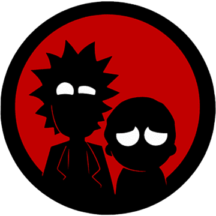

# Proyecto de uso de api de "Rick & Morty"

Documentacion de la api : https://rickandmortyapi.com/documentation/

Herramientas usadas : Html, JavaScript, Css, React, React-Bootstrap y React-Router.

El proyecto tiene como finalidad la exploracion de los personajes que componen la serie de "Rick and Morty" la cual cuenta con una basta variedad de personajes. Tambien se mostrara un poco de la informacion personal del personajes a eleccion, localizacion ocupada, episodio donde es visto y contara con un buscador si se quiere buscar uno especifico.
La imagenes de los personajes provienen de la api pero para las imagenes de fondo o iconos se encontraron en la red para crear un mejor diseño en el proyecto. Cabe recalcar que este es un proyecto te practica con posibilidad de mejoras.

Link de visualizacion del proyectos : https://infiniterick.netlify.app/

